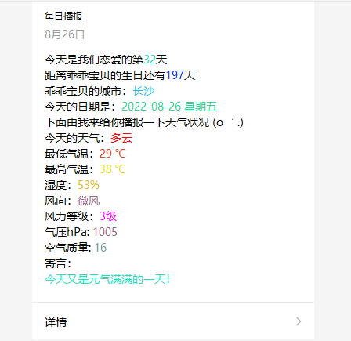

### 先看示例图



1. 设置配置文件中的微信公众测试号的appid和secret，以及接收者的openId
```properties
wx.appid=
wx.secret=
wx.openId=
```
2. 修改代码中的生日时间和恋爱开始时间

3. 修改获取天气信息接口中的城市名为你女朋友所在的城市，不要带市和区, 支持市区县, 不支持乡镇级别; 如: 青岛、铁西

4. 修改RequestVO类中的模板id

5. 模板内容信息如下
```text
今天是我们恋爱的第{{love.DATA}}天
距离乖乖宝贝的生日还有{{birthday.DATA}}天
乖乖宝贝的城市：{{city.DATA}}
今天的日期是：{{date.DATA}}
下面由我来给你播报一下天气状况 (o‘ .)
今天的天气：{{weather.DATA}}
最低气温：{{minTemperature.DATA}}
最高气温：{{maxTemperature.DATA}}
湿度：{{humidity.DATA}}
风向：{{windDirection.DATA}}
风力等级：{{windLevel.DATA}}
气压hPa: {{airPressure.DATA}}
空气质量: {{airQuality.DATA}}
寄言：
{{presence.DATA}}
```

最终启动项目即可