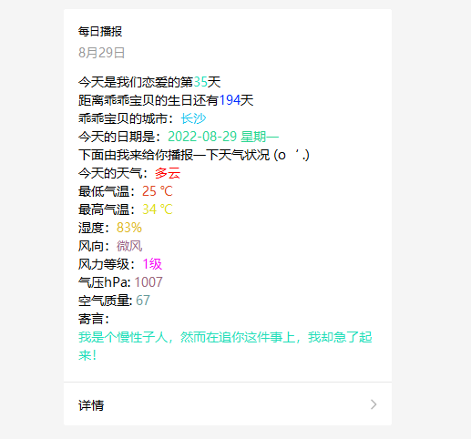

### 先看示例图



tip:注册测试公众号 -> [微信公众平台 (qq.com)](https://mp.weixin.qq.com/debug/cgi-bin/sandbox?t=sandbox/login)

1. 设置配置文件中的微信公众测试号的appid和secret，以及接收者的openId（接收者id扫测试号里面的二维码可以看到）
```properties
wx.appid=
wx.secret=
wx.openId=

#每天的13时14分的0秒发送
#cron.set=0 14 13 * * ?
cron.set=0 34 22 * * ?
#爱人的生日 格式 yyyy-mm-dd
spouse.birthday=
#情窦初开的日子 格式 yyyy-mm-dd
first.day.of.love=
#思念指向的城市（如上海、武汉等，名字不要带市，不支持乡镇）
acacia.city=
#生日按照哪种日历 true阴历，false洋历
birthday.chineseDate=true
#消息模板ID
message.template.id=
```
2. 模板内容信息如下

```text
今天是我们恋爱的第{{love.DATA}}天
距离乖乖宝贝的生日还有{{birthday.DATA}}天
乖乖宝贝的城市：{{city.DATA}}
今天的日期是：{{date.DATA}}
下面由我来给你播报一下天气状况 (o‘ .)
今天的天气：{{weather.DATA}}
最低气温：{{minTemperature.DATA}}
最高气温：{{maxTemperature.DATA}}
湿度：{{humidity.DATA}}
风向：{{windDirection.DATA}}
风力等级：{{windLevel.DATA}}
气压hPa: {{airPressure.DATA}}
空气质量: {{airQuality.DATA}}
寄言：
{{presence.DATA}}
```

最终启动项目即可
